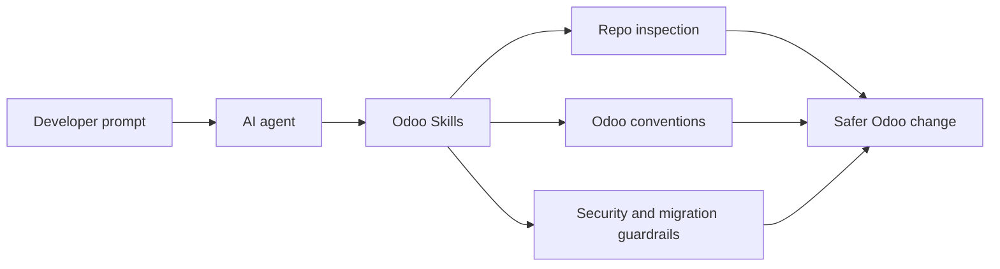

<div align="center">

# Odoo Skills

**Odoo-specific agent skills for idea validation, safer addon work, sharper reviews, execution tracing, test writing, OWL frontend changes, version references, and OCA migrations.**

[](#skills)
[](https://www.odoo.com/)
[](https://odoo-community.org/)
[](https://nodejs.org)
[](https://github.com/mart337i/odoo-skills/commits/main)
[](https://github.com/mart337i/odoo-skills/stargazers)

</div>

---

## Table Of Contents

- [What Is This?](#what-is-this)
- [Why Use It?](#why-use-it)
- [Quick Start](#quick-start)
- [Real-World Example](#real-world-example)
- [Skills](#skills)
- [Project Structure](#project-structure)
- [Recommended Environment](#recommended-environment)
- [How It Works](#how-it-works)
- [Designed For](#designed-for)
- [Deliberately Out Of Scope](#deliberately-out-of-scope)
- [Stats](#stats)

---

## What Is This?

**Odoo Skills** is an Odoo-focused skill pack for AI coding agents working in Odoo codebases.

Odoo work is full of sharp edges: version-specific ORM APIs, XML loading order, record rules, `sudo()` boundaries, multi-company behavior, asset bundles, OWL version differences, and OCA migration conventions. Generic agents regularly miss those details.

This repo gives your agent a practical Odoo operating manual: what to inspect, what to ask, what not to run without confirmation, and which Odoo-specific risks to check before claiming a task is done.

---

## Why Use It?

| Generic Agent | With Odoo Skills |
|---|---|
| Guesses the Odoo version from memory | Detects version from branch, manifests, docs, config, or local source |
| Treats Odoo like normal Python + XML | Checks ORM, manifests, security CSVs, record rules, views, assets, tests, and version-specific APIs |
| Suggests commands that may touch the wrong database | Reads local setup docs/base command and asks before database-touching commands |
| Misses multi-company and portal/public exposure | Reviews groups, ACLs, record rules, `sudo()`, domains, and company isolation together |
| Mixes migration cleanup with feature changes | Keeps OCA migration compatibility work separate from behavior changes |
| Adds code without proving behavior | Writes Odoo tests at the ORM, form, access, controller, report, or mocked integration seam |
| Uses generic frontend advice | Routes OWL work through component, template, reactivity, props, assets, and migration guidance |

---

## Quick Start

Install directly with `npx` from GitHub:

```bash
npx github:mart337i/odoo-skills
```

Install only one target:

```bash
npx github:mart337i/odoo-skills --target opencode
npx github:mart337i/odoo-skills --target claude
```

After publishing to npm, the package can also be run as:

```bash
npx @mart337i/odoo-skills
```

The installer copies all skills into both `~/.claude/skills` and `~/.config/opencode/skills` by default. Existing skills with the same names are moved into a timestamped `.backup-odoo-skills-*` folder before replacement.

For local development, clone the repo:

```bash
git clone https://github.com/mart337i/odoo-skills.git
cd odoo-skills
```

Then symlink into Claude-style skills:

```bash
./scripts/link-skills.sh
```

Restart or reload your agent so it picks up the new skill list.

---

## Real-World Example

**Prompt:**

> Add a portal endpoint that lets customers download a PDF report for their own records.

| Without Odoo Skills | With Odoo Skills |
|---|---|
| Adds a controller and calls `sudo()` to fetch the record | Asks which model/report, confirms portal ownership rule, checks `auth`, CSRF, access rights, record rules, and whether `sudo()` is safe |
| Puts the route in any controller file | Inspects existing controller structure and route naming conventions |
| Returns a PDF if the ID exists | Verifies the current user can access that record and cannot enumerate others |
| Skips verification | Traces route -> model -> report flow and proposes a portal/controller test or realistic user access check before running commands |

The point is not more ceremony. The point is fewer security bugs, fewer broken module updates, and less cleanup after the agent "helped."

---

## Skills

| Skill | Use It For |
|---|---|
| **[grill-me](./skills/grill-me/SKILL.md)** | Stress-test Odoo plans before implementation: addon boundaries, models, security, UI flows, data, OWL, migrations, and verification. |
| **[idea-gates](./skills/idea-gates/SKILL.md)** | Validate whether an Odoo module, addon, app, or product idea should exist: existing alternatives, buyer demand, wedge, reach, Odoo fit, and value equation. |
| **[owl](./skills/owl/SKILL.md)** | Build, review, debug, and migrate OWL frontend code: components, templates, reactivity, hooks, props, plugins, registries, and Odoo assets. |
| **[odoo](./skills/odoo/SKILL.md)** | General Odoo addon development: exploration, debugging, architecture review, manifest/docs sync, models, views, controllers, reports, tests, and security. |
| **[odoo-17.0](./skills/odoo-17.0/SKILL.md)** | Odoo 17 reference guides for actions, controllers, data, decorators, fields, manifests, migrations, mixins, models, OWL, performance, reports, security, testing, transactions, translations, and views. |
| **[odoo-18.0](./skills/odoo-18.0/SKILL.md)** | Odoo 18 reference guides for actions, controllers, data, decorators, fields, manifests, migrations, mixins, models, OWL, performance, reports, security, testing, transactions, translations, and views. |
| **[odoo-19.0](./skills/odoo-19.0/SKILL.md)** | Odoo 19 reference guides for actions, controllers, data, decorators, fields, manifests, migrations, mixins, models, OWL, performance, reports, security, testing, transactions, translations, and views. |
| **[odoo-code-review](./skills/odoo-code-review/SKILL.md)** | Review Odoo code for correctness, security, performance, migrations, tests, manifests, and official coding guidelines. |
| **[odoo-code-tracer](./skills/odoo-code-tracer/SKILL.md)** | Trace execution through controllers, buttons, cron jobs, model methods, overrides, computes, onchanges, constraints, database operations, side effects, and security checks. |
| **[odoo-migration](./skills/odoo-migration/SKILL.md)** | End-to-end OCA module migration workflow for `[MIG]` pull requests, with version tips from `8.0` through `19.0`. |
| **[odoo-test-writer](./skills/odoo-test-writer/SKILL.md)** | Create Odoo tests with TransactionCase, SingleTransactionCase, HttpCase, AccountTestInvoicingCommon, Form helper, tags, mocks, access tests, workflow tests, and coverage patterns. |

---

## Project Structure

```text
odoo-skills/
├── AGENTS.md
├── CLAUDE.md
├── README.md
├── bin/
│   └── odoo-skills.js
├── package.json
├── scripts/
│   └── link-skills.sh
└── skills/
    ├── grill-me/
    ├── idea-gates/
    ├── odoo/
    ├── odoo-17.0/
    ├── odoo-18.0/
    ├── odoo-19.0/
    ├── odoo-code-review/
    ├── odoo-code-tracer/
    ├── odoo-migration/
    ├── odoo-test-writer/
    └── owl/
```

There are no bucket folders. Skills live directly under `skills/` so they are easy to link into different agent environments.

---

## Recommended Environment

If your Odoo source checkout is outside the project being edited, expose it so agents can inspect framework code instead of relying on memory:

```bash
export ODOO_SOURCE=/path/to/odoo
```

You can also expose your local Odoo command and setup docs:

```bash
export ODOO_BASE_COMMAND="/path/to/odoo/odoo-bin -c /path/to/odoo.conf --addons-path=/path/to/addons"
export ODOO_TOOL_README=/path/to/local-development/README.md
```

`ODOO_BASE_COMMAND` is the base command agents should inspect before proposing install/update/test commands. `ODOO_TOOL_README` points to local setup documentation agents should read before using project-specific tooling.

Put those exports in your shell profile if you want them available in every agent session.

---

## How It Works



The skills push agents toward a simple discipline:

1. Detect the Odoo version and repo shape.
2. Use version-specific references for Odoo 17, 18, and 19 when detailed API guidance is needed.
3. Read manifests, models, views, security, assets, tests, and docs before editing.
4. Trace execution paths when behavior depends on controllers, buttons, cron jobs, overrides, or side effects.
5. Write tests at the Odoo behavior seam: ORM, form, access, workflow, controller, report, or mocked integration.
6. Use local Odoo source and setup docs when available.
7. Ask before running commands that touch databases or services.
8. Verify at the Odoo behavior seam, not just with generic static checks.

---

## Designed For

- Odoo addon development.
- Odoo module and app idea validation before implementation.
- OCA repositories.
- OCA module migrations between major Odoo versions.
- OWL/web client frontend work.
- Odoo code reviews and architecture checks.
- Odoo test writing for custom modules.
- Odoo execution tracing and impact analysis.
- Odoo 17, 18, and 19 version-specific reference lookup.
- Agents working in unfamiliar Odoo codebases.

---

## Deliberately Out Of Scope

OpenUpgrade workflows are not covered. The migration skill is for normal OCA module migration and `[MIG]` pull request preparation.

---

## Stats

| Metric | Value |
|---|---|
| Skills | 11 |
| Installer | `npx github:mart337i/odoo-skills` |
| OCA migration coverage | `8.0` through `19.0` |
| Version reference coverage | Odoo 17.0, 18.0, 19.0 |
| Main focus | Odoo addon engineering |
| Frontend coverage | OWL, Odoo assets, templates, reactivity, migration |
| Testing coverage | TransactionCase, SingleTransactionCase, HttpCase, Form helper, mocks, tags, access tests |
| Safety focus | code review, execution tracing, security, multi-company, manifests, database-touching commands |

---

<div align="center">

If this saves you from one bad `sudo()`, one broken XML load order, or one wrong-version migration, it did its job.

Star the repo if you find it useful.

</div>
